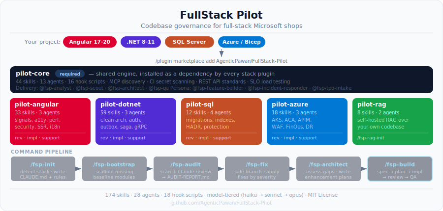

# FullStack Pilot

> 150+ governance skills and 17 specialist agents for [Claude Code](https://claude.ai/code) — Angular · .NET · SQL Server · Azure

<p align="center">
  
</p>

## The problem

Teams using Claude Code for full-stack Microsoft apps keep re-inventing the same rules: every `CLAUDE.md` hand-rolls the same auth pattern, the same "parameterized queries only" SQL convention, the same "no role checks — permissions only" guard. When those rules drift between projects or a new developer skips one, production gets a bug or a compliance finding.

FullStack Pilot ships those rules as 150+ versioned, stack-specific skills and 17 specialist agents. Every new project starts from a consistent governance baseline rather than a blank slate.

## Install

```shell
# 1. Register once per machine
/plugin marketplace add AgenticPawan/FullStack-Pilot

# 2. Install the plugins that match your stack (pilot-core is always required)
/plugin install pilot-core@fullstack-pilot
/plugin install pilot-angular@fullstack-pilot    # Angular 17–20
/plugin install pilot-dotnet@fullstack-pilot     # C# / ASP.NET Core 8–11
/plugin install pilot-sql@fullstack-pilot        # SQL Server / EF Core
/plugin install pilot-azure@fullstack-pilot      # Azure / Bicep
/plugin install pilot-rag@fullstack-pilot        # optional: self-hosted RAG over your own codebase

# 3. Reload
exit   # then: claude
```

**Local / development install** — if you've cloned this repo and want to test changes locally:

```shell
/plugin marketplace add ./
/plugin install pilot-core@fullstack-pilot
# or load a single plugin directly:
# claude --plugin-dir ./plugins/pilot-core
```

## The governance pipeline

Run these commands once in any project to bootstrap governance, then just keep coding:

| Command | What it does |
|---|---|
| `/fsp-init` | Detects your Angular/.NET/SQL/Azure versions; writes `CLAUDE.md` and version-gated rules |
| `/fsp-bootstrap` | Scaffolds missing baseline modules — auth, authz, logging, error-handling, health-checks, CORS |
| `/fsp-audit` | Runs your tools + a Claude-driven review; writes `AUDIT-REPORT.md` and `findings.json` |
| `/fsp-fix --batch P0` | Applies the most-critical findings on a safe git branch for you to review and merge |
| `/fsp-architect` | Assesses the whole solution against the target state; writes a ranked gap register with ready-to-run `/fsp-build` lines |
| `/fsp-build <feature>` | Spec → scout → plan → **your confirmation** → implement → paired review → QA traceability, on a reviewable branch |

`/fsp-build` uses a four-role delivery team — `@fsp-analyst` (spec), `@fsp-scout` (context), `@fsp-architect` (plan), `@fsp-qa` (test traceability) — with each role running on the cheapest model tier that can do its job. A stopped run resumes with `--resume`. Auth changes, destructive migrations, and public-API contract changes always stop for your sign-off even with `--yes`.

## Agents — reviewer, implementor, support

Each stack plugin ships a specialist trio you invoke by @-mentioning in any Claude Code prompt:

| Stack | Reviewer (read-only) | Implementor (writes files) | Support (diagnoses) |
|---|---|---|---|
| Angular | `@angular-reviewer` | `@angular-implementor` | `@angular-support` |
| .NET / ASP.NET Core | `@dotnet-reviewer` | `@dotnet-implementor` | `@dotnet-support` |
| SQL Server / EF Core | `@sql-reviewer` | `@sql-implementor` | `@sql-support` |
| Azure / Bicep | `@infra-reviewer` | `@infra-implementor` | `@infra-support` |
| All layers at once | `@fullstack-reviewer` | `@fullstack-implementor` | `@fullstack-support` |

**Reviewers** find problems and output structured findings with standard IDs, severity, and fix guidance — they never modify files.  
**Implementors** apply those findings (or build features), verify with your build, and leave the diff for your review. They never commit.  
**Support** agents diagnose symptoms ("this endpoint returns 500") to a specific `file:line` cause, then hand off to the implementor.

If you don't know which layer owns a problem, start with `@fullstack-support` — it triages the symptom and routes to the right specialist.

Two support agents go beyond source: `@infra-support` can query live Azure diagnostics (resource health, metrics, App Lens), and `@angular-support` can inspect the running browser console and network traffic via Playwright — both strictly read-only.

## Plugins

| Plugin | Skills | Agents | Highlights |
|---|---|---|---|
| `pilot-core` | 24 | 7 | Stack detection, `/fsp-bootstrap`, audit/fix/build pipelines, MCP server discovery, CI secret scanning, REST API design standards, SLO load testing, git governance, incident-response runbook, license compliance, supply-chain policy |
| `pilot-angular` | 32 | 3 | Signals & NgRx, a11y (WCAG 2.2 AA), motion/reduced-motion, performance budgets, security (XSS/CSP/permissions-only guards), HTTP resilience, SSR, real-time/SignalR, i18n, PWA, visual regression, v15→v20 upgrade path |
| `pilot-dotnet` | 57 | 3 | Clean Architecture, permissions-only auth, multitenancy, soft delete, audit fields, transactional outbox, Saga orchestration, gRPC, GraphQL, BFF, chaos engineering, NuGet Central Package Management |
| `pilot-sql` | 11 | 3 | Migration safety, injection defense, schema design, temporal tables/CDC, HADR failover (Always On AGs, Azure SQL failover groups), data protection (TDE / DDM / Always Encrypted), index maintenance, backup/restore drills |
| `pilot-azure` | 18 | 3 | CAF naming, security baseline, WAF review, AKS governance, Container Apps, APIM policy, edge WAF, Key Vault + App Config, FinOps guardrails, multi-region DR, container image security, SLO/error-budget policy |
| `pilot-rag` | 7 | 2 | `/fsp-rag-init` scaffolds a local self-hosted RAG system into `./pilot-rag/` — Microsoft.Extensions.AI abstraction (swap Ollama↔Azure OpenAI by appsettings only), Qdrant, five chunkers with idempotent ingestion, SSE `/ask` with score floor and source citation, Angular Signals chat UI, 80% retrieval hit-rate gate |

## Prerequisites

- **[Claude Code](https://claude.ai/code)** — CLI (`npm i -g @anthropic-ai/claude-code`), desktop app, or VS Code extension
- **Git** — `git --version` should print something, not an error
- A project directory — any subset of Angular, .NET, SQL Server, Azure works; an empty folder is fine for new projects

## Validate locally

```shell
node scripts/validate.mjs
```

Checks `marketplace.json`, every `plugin.json`, every `SKILL.md` frontmatter (description ≤ 1024 chars), and every `hooks.json` for schema correctness and script existence. Exits non-zero on any failure.

## Relationship to dotnet/skills

FullStack Pilot builds on, not replaces, Microsoft's official [`dotnet/skills`](https://github.com/dotnet/skills). `/fsp-init` prints the exact install commands for it when it detects .NET. Routing: EF Core performance/query optimization, test running, framework upgrades, and minimal-API endpoint work route to `dotnet/skills`. `pilot-dotnet` covers the conventions Microsoft's skills deliberately leave to each team — Clean Architecture layering, permission-based auth, multitenancy, audit fields, API versioning, modular DI.

## Supported versions

| Stack | Active rules | Upgrade-path only (EOL, no new rules) |
|---|---|---|
| Angular | 17, 18, 19, 20 | 15, 16 — `angular-upgrade-path` skill covers migration only |
| .NET | 8, 9, 10, 11 | 6, 7 — covered by `dotnet/skills` `dotnet-upgrade` |
| SQL Server | Current + prior LTS | — |
| Azure | Current Bicep API versions | — |

If `/fsp-init` detects Angular 15/16 or .NET 6/7 it prints an EOL advisory rather than silently applying rules meant for supported versions.

## Documentation

| Doc | What's in it |
|---|---|
| [docs/pilot-core.md](docs/pilot-core.md) | Pipeline reference — `/fsp-init` through `/fsp-build`, delivery team, cross-stack agents |
| [docs/pilot-angular.md](docs/pilot-angular.md) · [pilot-dotnet.md](docs/pilot-dotnet.md) · [pilot-sql.md](docs/pilot-sql.md) · [pilot-azure.md](docs/pilot-azure.md) · [pilot-rag.md](docs/pilot-rag.md) | Per-plugin skill index and standard-ID catalog |
| [CLAUDE.md](CLAUDE.md) | Plugin layout conventions, skill authoring, hooks, commit format |
| [docs/CONTRIBUTING.md](docs/CONTRIBUTING.md) | PR process, skill authoring guide |
| [docs/SECURITY.md](docs/SECURITY.md) | Vulnerability reporting |
| [CHANGELOG.md](CHANGELOG.md) | Release history |

## License

[MIT](LICENSE) © FullStack Pilot Contributors
